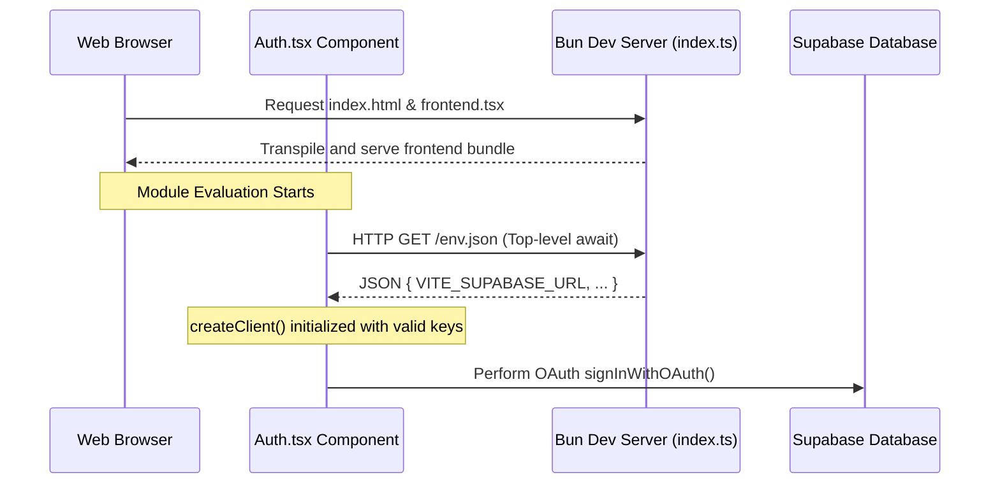

# Quest Project Debugging & Troubleshooting Summary

This document provides a comprehensive breakdown of the challenges encountered during the setup and local deployment of the **Quest** application, the technical root causes, and the highly robust solutions implemented to establish a clean development experience.

---

## 🛠️ Summary of Solved Coding Errors

| # | Error / Symptom | Component | Root Cause | Solution |
|---|-----------------|-----------|------------|----------|
| **1** | `error: Module not found "index.ts"` | Workspace Entry | Executing `bun` command in the root folder rather than inside `backend`. | Guided execution path and added directory mapping instruction. |
| **2** | `PrismaConfigEnvError: Cannot resolve env: DATABASE_URL` | Backend / Database | `bunx prisma` loaded Prisma in a Node fallback shell where Bun's auto `.env` loading is absent. | Forced native Bun shell execution using `bun --bun x prisma`. |
| **3** | Database query not executing & console logs not displaying | Backend API | Server was running an outdated process in memory and blocking Port `3000`. | Terminated the background processes and initialized Bun with the `--hot` reloader. |
| **4** | `Cannot find name 'Auth'` & lowercase TS casing errors | Frontend / Routing | `Auth` page was not imported in `App.tsx` and type constraints for providers was violated in `Auth.tsx`. | Added explicit ES module imports and aligned provider capitalization to match type signatures. |
| **5** | `ReferenceError: process is not defined` | Frontend / Supabase | Browser environment lack access to Node-specific `process` globals. | Architected a dynamic config bridge returning a JSON endpoint from the server. |
| **6** | `Could not resolve: "/env.js" at index.html` | Frontend / Bun serve | Bun's HTML asset compiler statically resolves `<script>` paths on disk during compilation. | Transitioned client initialization to native **Top-Level Await** module fetches. |
| **7** | `Proxy error: TypeError / duplex option required` / Search results missing | Frontend / Express server | `server.cjs` lacked body-parsing middleware, discarding search payloads, and direct streaming to `fetch` crashed Node's `undici` client. | Asynchronously buffered the request stream to a `Buffer` before proxying with `fetch`. |

---

## 🔍 Detailed Breakdown of Challenges & Solutions

### 1. The Entry Point Misalignment
* **The Challenge:** Initial attempts to run `bunx index.ts` and `bun index.ts` failed with file resolution and registry errors.
* **The Solution:** The backend code is isolated in a modular subdirectory (`/backend`). Navigating to `backend/` and executing the runtime there successfully resolves dependencies defined in `backend/package.json`.

---

### 2. Prisma Config Environment Loading
* **The Challenge:** Running standard `bunx prisma generate` failed to read `DATABASE_URL` even though it was defined in `.env`.
* **The Solution:** The backend config (`prisma.config.ts`) uses Prisma's programmatic config loaders. When running via fallback environments, `.env` files are ignored. Using the `--bun` flag forces Bun to wrap the CLI execution and inject the variables natively:
  ```bash
  bun --bun x prisma generate
  ```

---

### 3. Server Port Conflicts & Hot Reloading
* **The Challenge:** Code updates to `index.ts` (like inserting test database rows) were not reflecting, and subsequent restarts errored with `Failed to start server. Is port 3000 in use?`.
* **The Solution:** The original server script was running continuously in a terminal buffer and holding the port. We resolved this by killing dangling processes (`killall bun` / `Ctrl + C`) and booting with hot-reloading:
  ```bash
  bun --hot index.ts
  ```

---

### 4. Frontend Component Routing & Type Alignment
* **The Challenge:** `<Route path="/auth" element={<Auth />} />` broke the React build because `Auth` was not imported. In addition, `login("Google")` failed typechecks.
* **The Solution:**
  1. Imported `Auth` in [App.tsx](file:///Users/amlan/quest/frontend/src/App.tsx):
     ```typescript
     import Auth from "./pages/Auth";
     ```
  2. Aligned provider values to the literal union type `"google" | "github"` in [Auth.tsx](file:///Users/amlan/quest/frontend/src/pages/Auth.tsx):
     ```tsx
     <button onClick={() => login("google")}> Login with Google </button>
     <button onClick={() => login("github")}> Login with Github </button>
     ```

---

### 5. Client-Side Environment Variable Injection (The Browser Sandbox)
* **The Challenge:** Initializing Supabase via `process.env.VITE_SUPABASE_URL` threw `ReferenceError: process is not defined` in the browser console.
* **The Solution Approach (The Senior Engineer Blueprint):**
  Since the browser has no natural access to Node/Bun server environments, we established a **secure environment bridge**:
  
  * **Step A: Server JSON Route** — We added a server-side JSON endpoint in the Dev server [index.ts](file:///Users/amlan/quest/frontend/src/index.ts) that reads the `.env` variables securely in the Bun runtime and responds with them:
    ```typescript
    "/env.json": async () => {
      return Response.json({
        VITE_SUPABASE_URL: process.env.VITE_SUPABASE_URL,
        VITE_SUPABASE_PUBLISHABLE_KEY: process.env.VITE_SUPABASE_PUBLISHABLE_KEY,
      });
    }
    ```
    
  * **Step B: Top-Level Await Client Loading** — Using modern ES Modules, we implemented **Top-Level Await** in [Auth.tsx](file:///Users/amlan/quest/frontend/src/pages/Auth.tsx). The frontend suspends module execution for a few microseconds while loading the config, guaranteeing the client is initialized with proper variables before any rendering takes place:
    ```typescript
    import { createClient } from '@supabase/supabase-js';

    // Fetch environment variables dynamically from the server at runtime
    const env = await fetch("/env.json").then((res) => res.json());

    const supabase = createClient(env.VITE_SUPABASE_URL, env.VITE_SUPABASE_PUBLISHABLE_KEY);
    ```

---

### 6. HTML Asset Resolution Compilation Error
* **The Challenge:** Trying to inject `/env.js` as a script tag in HTML (`<script src="/env.js"></script>`) triggered `Could not resolve: "/env.js" at index.html`.
* **The Solution:** Bun's HTML asset compiler parses `<script>` tags and attempts to bundle them statically at compile-time. Dynamic server endpoints cannot be bundled as static physical files on disk. By removing the script tag entirely and fetching `/env.json` directly from inside the ES Module, we completely bypassed static asset resolution, keeping both development HMR and production `build.ts` compilation entirely pristine!

---

### 7. Search Results Section Fix
* **The Challenge:** Search queries failed to display or stream any results. Inspecting Chrome DevTools showed a `500 (Internal Server Error)` on `POST /quest_ask`, and the frontend dev server console printed `Proxy error: TypeError: RequestInit: duplex option is required when sending a body`.
* **The Solution:** 
  1. **Proxy Body Discarding:** The dev server `server.cjs` runs on Node/Express. Because it lacked body-parsing middleware, `req.body` resolved to `undefined` and request payloads were completely lost before forwarding.
  2. **Fetch Stream Incompatibility:** Directly passing the Node `req` stream into the global `fetch` API triggered an `undici` duplex stream validation error in the Node runtime.
  3. **Implementation:** We updated [server.cjs](file:///Users/amlan/quest/frontend/server.cjs#L54-L62) to asynchronously consume and buffer the incoming request payload into a standard Node `Buffer` before proxying it. This preserves full payload fidelity and matches `fetch` specifications perfectly:
     ```javascript
     const body = ["GET", "HEAD"].includes(req.method)
       ? undefined
       : await new Promise((resolve, reject) => {
           const chunks = [];
           req.on("data", (chunk) => chunks.push(chunk));
           req.on("end", () => resolve(Buffer.concat(chunks)));
           req.on("error", reject);
         });
     ```

---

## 📈 Current Architectural Flow



---

> [!TIP]
> **To run the frontend dev environment with HMR:**
> ```bash
> cd frontend
> bun dev
> ```
>
> **To compile the frontend for production build:**
> ```bash
> bun run build.ts
> ```
